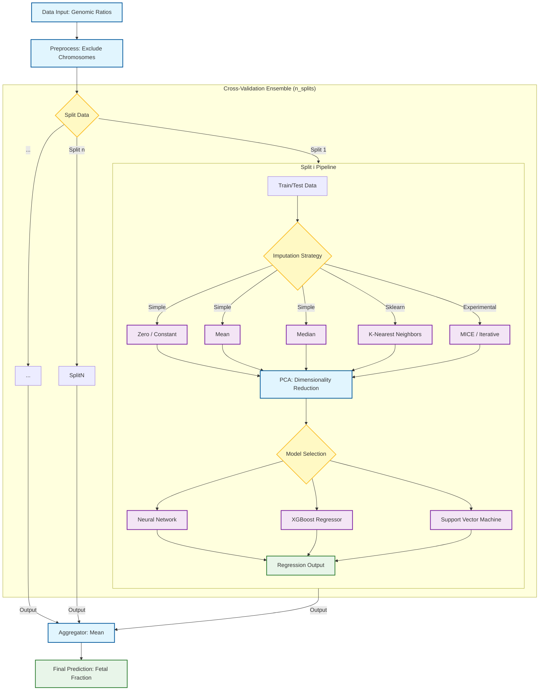

# Background

A share of all cell-free DNA fragments isolated from maternal plasma during pregnancy is fetal-derived. This amount is referred to as the 'fetal fraction' and represents an important estimate during routine noninvasive prenatal testing (NIPT). Its most essential role is informing geneticists whether an assay is conclusive: if the fetal fraction is insufficient (this limit has often been debated to be 4%) claims on fetal aneuploidies cannot be made accurately. Several techniques exist to deduce this figure, but the far most require additional experimental procedures, which impede routine execution. Therefore, we set out to develop PREFACE, a software to accurately predict fetal fraction based on solely shallow-depth whole-genome sequencing data, which is the fundamental base of a default NIPT assay. In contrast to previous efforts, PREFACE enables user-friendly model training with a limited amount of retrospective data, which eliminates between-laboratory bias. For sets of roughly 1100 male NIPT samples, a cross-validated correlation of 0.9 between predictions and fetal fractions according to Y chromosomal read counts was noted (FFY). Our approach enables training with both male and unlabeled female fetuses: using our complete cohort (nfemale=2468, nmale=2723), the correlation metric reached 0.94. In addition, PREFACE provides the fetal fraction based on the copy number state of chromosome X (FFX). The presented statistics indirectly predict mixed multiple pregnancies, the source of observed events and sex chromosomal aneuploidies. All details can be found in our [corresponding paper](https://www.ncbi.nlm.nih.gov/pubmed/31219182).  

# Manual

## Required files

### Copy number alteration .bed files

Each sample (whether it is used for training or for predicting) should be passed to PREFACE in the format shown below. During benchmarking, using a bin size of 100 kb (others might work equally well), copy number normalization was performed by [WisecondorX](https://github.com/CenterForMedicalGeneticsGhent/WisecondorX/), yet PREFACE is not limited to any copy number alteration software, however, the default output of WisecondorX is directly interpretable by PREFACE.  

- Example: ```./examples/ratios.bed```  
- Tab-separated file with at least four columns.  
- The name of these columns (passed as a header) must be 'chr', 'start', 'end' and 'ratio'.  
    - The possible values of 'chr' are 1 until 22, and X and Y (uppercase).  
    - The 'ratio' column contains the log2-transformed ratio between the observed and expected copy number.  
    - The ratio can be unknown at certain loci (e.g. often seen at centromeres). Here, values should be expressed as 'NaN' or 'NA'.  
- The order of rows does not matter. Yet, it is paramount that, for a certain line, file x deals with the same locus as file y. This implies, of course, that all copy number alteration files have the same number of lines.  

### PREFACE's samplesheet.tsv

For training, PREFACE requires a samplesheet file.  

- Example: ```./examples/samplesheet.tsv```  
- TSV file with at least four columns.  
- The name of these columns (passed as a header) must be 'ID', 'filepath', 'sex' and 'FF'.  
    - 'ID' is used to specify a mandatory unique identifier to each of the samples.  
    - The 'filepath' column holds the full absolute path of the training copy number alteration files (.bed).  
    - The possible values for 'sex' are either 'M' (male) or 'F' (female), representing fetal gender.  
    - The 'FF' column contains the response variable (the 'true' fetal fraction). One can use any method he/she believes performs best at quantifying the actual fetal fraction. PREFACE was benchmarked using the number of mapped Y-reads, referred to as FFY.

## Installation & Setup

PREFACE can be installed using `pip`:

```bash
pip install .
```

Alternatively, for a reproducible environment using [pixi](https://pixi.sh):

```bash
pixi install
pixi run PREFACE --help
```

## Model training

The core of PREFACE is its ability to train a predictive model on your own cohort data.

```bash
PREFACE train --samplesheet path/to/samplesheet.tsv [optional arguments]
```

### Training Process

The training pipeline is a robust, multi-step process designed to build a generalized and accurate model:

1.  **Data Loading & Preprocessing**: The tool begins by loading all samples defined in the samplesheet. It checks for data consistency across files and filters out genomic bins (features) that have more than 1% missing values.
2.  **Imputation**: Any remaining missing values (`NaN`) are handled using the strategy specified by the `--impute` option (e.g., filling with the mean, median, using MICE or k-NN).
3.  **Cross-Validation**: To prevent overfitting and get a reliable estimate of performance, PREFACE uses a `GroupShuffleSplit` strategy. It repeatedly splits the data into training and testing sets, ensuring that the distribution of fetal fraction values is similar in each split.
4.  **Dimensionality Reduction**: For each training split, Principal Component Analysis (PCA) is performed to reduce the high-dimensional genomic data into a smaller, more informative set of features (`--nfeat`).
5.  **Model Fitting**: A predictive model is trained on the PCA-reduced data. You can choose between three architectures using the `--model` flag: a `neural` network, `xgboost`, or `svm`.
6.  **Hyperparameter Tuning (Optional)**: If you add the `--tune` flag, PREFACE will first run an optimization process using Optuna to find the best hyperparameters for the chosen model architecture on your specific dataset.
7.  **Ensemble Creation**: Instead of relying on a single model, PREFACE builds an ensemble from all the models trained during the cross-validation splits. This technique typically results in a more robust and accurate final model. The ensemble, including the complete preprocessing pipeline (imputation and PCA), is saved as a single `PREFACE.onnx` file.

### Ensemble Topology

This diagram illustrates the structure of the PREFACE ensemble model, including data processing, cross-validation splits, and model options.



### Options

| Argument | Type | Default | Function |
| :--- | :--- | :--- | :--- |
| `--samplesheet` | PATH | (Required) | Path to the samplesheet TSV file. |
| `--outdir` | PATH | (Current Dir) | Output directory for models and plots. |
| `--impute` | [zero\|mice\|mean\|median\|knn] | `zero` | Strategy to handle missing values (NaNs). |
| `--exclude-chrs` | TEXT | `13,18,21,X,Y` | Chromosomes to exclude from training features. |
| `--nsplits` | INTEGER | `10` | Number of splits for cross-validation. |
| `--nfeat` | INTEGER | `50` | Number of features (PCA components) to use. |
| `--tune` | BOOLEAN | `False` | Enable automatic hyperparameter tuning (via Optuna). |
| `--model` | [neural\|xgboost\|svm] | `neural` | Type of model architecture to train. |


## Predicting

```bash
PREFACE predict --infile path/to/infile.bed --model path/to/PREFACE.onnx
```

### Options

| Argument | Type | Default | Function |
| :--- | :--- | :--- | :--- |
| `--infile` | PATH | (Required) | Path to input BED file for prediction. |
| `--model` | PATH | (Required) | Path to the trained `.onnx` model file. |

The prediction output includes both the predicted fetal fraction score and the fetal sex probability.

## Version

To check the installed version of PREFACE:

```bash
PREFACE version
```

## Model optimization
- The most important parameter is `--nfeat`:  
    - It represents the number of principal components (PCs) that will be used as features during model training. Depending on the used copy number alteration software, bin size and the number of training samples, it might have different optimal values. In general, I recommend to train a model using the default parameters. The output will contain a plot that enables you to review the selected `--nfeat`. Two parts should be seen in the proportion of variance across the principal components (indexed in order of importance):  
        - A 'random' phase (representing PCs that explain variance caused by, inter alia, fetal fraction).  
        - A 'non-random' phase (representing PCs that explain variance caused by natural Gaussian noise).  
    - An optimal `--nfeat` captures the 'random' phase (as shown in the example at `./examples/overall_performance.png`). Capturing too much of the 'non-random' phase could lead to convergence problems during modeling.  
    - If you are not satisfied with the performance of your model or with the position of `--nfeat`, re-run with a different number of features.  
- Note that the final model will probably be a bit more accurate than what is claimed by the performance statistics. This is because PREFACE uses a cross-validation strategy where a subset of samples are excluded from training, after which these serve as validation cases. This process is repeated `n` times (default 5). Therefore, the final performance measurements are based on models trained with only partial data, yet the resulting model is trained with all provided cases.  

# Utilities

## FFY Calculator

Calculates Fetal Fraction from Y-chromosome reads (FFY) directly from WisecondorX output files.

### Usage

```bash
PREFACE utils ffy <wisecondorx_npz> [--sex-cutoff <cutoff>] [--slope <slope>] [--intercept <intercept>]
```

| Argument | Type | Default | Function |
| :--- | :--- | :--- | :--- |
| `wisecondorx_npz`| ARGUMENT | (Required) | Path to WisecondorX output NPZ file. |
| `--sex-cutoff` | FLOAT | `0.2` | Cutoff for sex determination based on raw Y fraction. |
| `--slope` | FLOAT | `1.0` | Slope (m) for FFY calculation. |
| `--intercept` | FLOAT | `0.0` | Intercept (b) for FFY calculation. |

The Fetal Fraction (FFY) is calculated using the linear equation:
$$FFY = \frac{Y_{fraction} - \text{Intercept}}{\text{Slope}}$$
where $Y_{fraction}$ is the ratio of Y-mapped reads to total reads. The default values (m=1.0, b=0.0) return the raw Y fraction; adjust these based on your lab's calibration (e.g., from regression analysis of male samples).